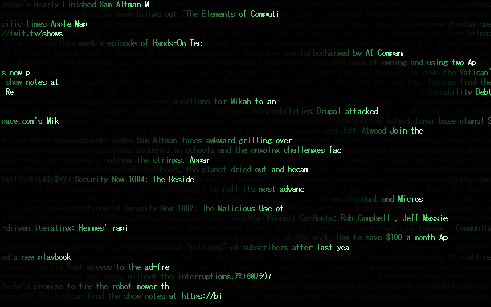
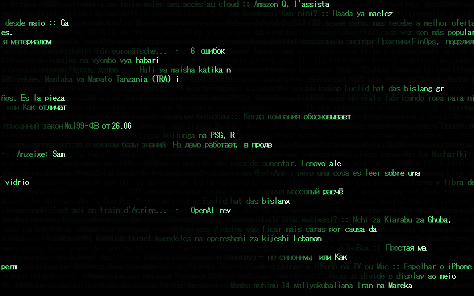
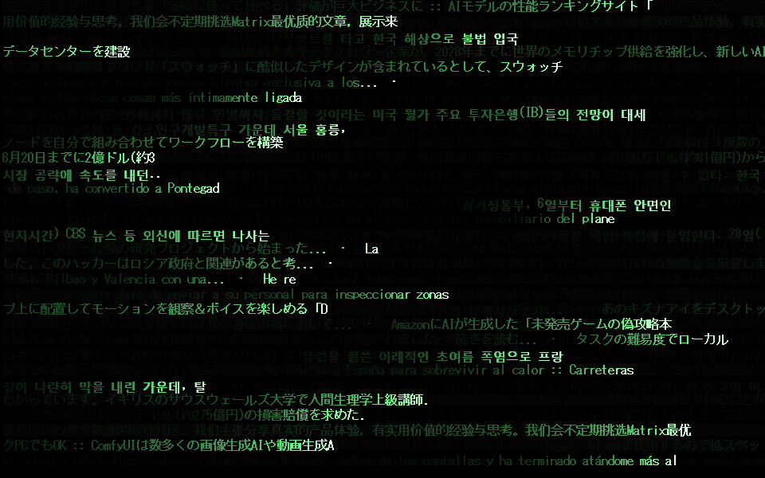

# rss-techno-ticker

**A native Windows screensaver that turns RSS feeds into a wall of Matrix-style tickers.**

Every screen row is an endless ribbon of real headlines — `TITLE :: DESCRIPTION` —
scrolling left-to-right and wrapping forever. Each character **shimmers through
random glyphs** as it decodes, ignites **white**, settles to **green**, and fades
to **black** behind the writing head, just like the digital rain. Dim, slow rows
drift behind the bright ones for a sense of depth. Optional katakana gibberish
fills the gaps between stories for the classic Matrix texture.



Point it at feeds in any language and it becomes a live world tech ticker:



Japanese, Korean, and Chinese render correctly on the same grid (full-width
glyphs take two cells):



## Features
- **Real Windows `.scr`** — handles `/s` (run), `/p` (settings-dialog preview),
  and `/c` (configure); multi-monitor; exits on mouse/keyboard.
- **No runtime to install** — a single ~25 KB executable built against the .NET
  Framework already present on every Windows machine.
- **Bring your own feeds** — RSS 2.0 *and* Atom. Feeds are fetched in parallel
  with a browser User-Agent; a slow or dead feed never blocks the others. Offline?
  A baked-in fallback keeps the rain falling.
- **Five color themes** — Matrix Green, Amber CRT, Ice Blue, Ghost White, Crimson.
- **Decode effect** — each new character flickers through random glyphs for a few
  frames before resolving into the real letter (toggleable).
- **Depth layers** — about a third of the rows run dimmer and slower, like rain
  falling further back; the foreground heads get a subtle glow.
- **Settings dialog** — add/remove feed URLs, **Test all** to health-check every
  feed (item count or the exact failure), cap or uncap description length,
  toggle the katakana filler, pick a theme, toggle the decode effect. Stored
  under `HKCU\Software\MatrixRain`.
- **Fast** — a glyph atlas cache means each (character, style) pair is rasterized
  once and blitted ever after; frame time is decoupled from timer jitter, and
  feeds silently re-fetch every 10 minutes so overnight sessions show fresh news.
- **Wide language support** — see below. A curated list of verified feeds in a
  dozen languages lives in [FEEDS.md](FEEDS.md).

## Install
1. Grab `MatrixRain.scr` (or build it yourself — one command, see below).
2. Right-click it → **Install** (Windows 11: the option is right there in the
   context menu). The Screen Saver Settings dialog opens with it selected — set
   your wait time and click OK.
3. Or right-click → **Test** to run it full-screen immediately.

To make it a permanent entry in the screensaver dropdown, run `Install.ps1`
(right-click → Run with PowerShell; asks for admin to copy into the system folder).

By default it streams [TWiT.tv's This Week in Tech](https://twit.tv) public feed —
open **Configure** to replace it with anything you like.

## Language support
| Scripts | How they render |
|---|---|
| Latin & Cyrillic (English, German, French, Spanish, Portuguese, Turkish, Russian, Swahili, …) | Perfectly aligned |
| CJK (Japanese, Korean, Chinese) | Aligned — full-width glyphs span two cells; Korean via Malgun Gothic |
| RTL (Hebrew, Arabic, Persian) | Rendered **upside-down on purpose** 🙃 |

The RTL trick: flip your monitor 180° and the per-glyph 180° rotation turns the
text upright *while* the left-to-right layout becomes right-to-left — so it reads
correctly. (Your LTR feeds go upside-down instead. That's the trade.) Hebrew comes
out fully correct; Arabic/Persian letters render in isolated forms since there's
no shaping engine.

## Build from source
No IDE or SDK needed — the compiler ships with Windows:

```powershell
& "C:\Windows\Microsoft.NET\Framework64\v4.0.30319\csc.exe" /nologo /target:winexe /optimize+ `
    /out:MatrixRain.scr `
    /reference:System.dll /reference:System.Drawing.dll `
    /reference:System.Windows.Forms.dll /reference:System.Xml.Linq.dll `
    MatrixRain.cs
```

Or just run `build.ps1`.

## The screensaver contract
A `.scr` is an ordinary `.exe` that Windows invokes with a flag:

| Flag | What it does |
|------|--------------|
| `/s` | Run full screen on every monitor |
| `/p <hwnd>` | Render the preview thumbnail inside Screen Saver Settings |
| `/c` | Show the configuration dialog |
| `/dump <path> [theme] [feedUrl]` | Render frames headlessly to a PNG (build verification / screenshots); writes a `.timing.txt` sidecar with the frame time |

Note: the `.scr` file association hijacks command-line arguments — to use `/dump`,
copy the file to a `.exe` name and invoke that directly.

## Tweaking the rendering (edit `MatrixRain.cs`, rebuild)
- **Theme colors** — the palette table in `Theme.Get` (head flash / settled text / filler).
- **Trail length** — the alpha of `_fade` (lower = longer-lived text).
- **Head ramp length** — the `Ramp` constant; **shimmer duration** — `Scramble`.
- **Depth** — `FarDim` (how dark the far tier is) and the `0.35` far-row fraction.
- **Sweep speed** — the `_speed[r]` ranges in the constructor.
- **Text size** — `fontSize` in `MatrixForm.OnLoad` (18 full-screen, 11 preview).

## License
MIT — see [LICENSE](LICENSE).
